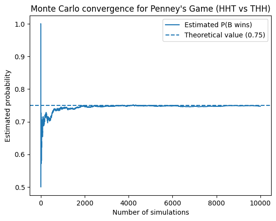

# Penney's Game
**Difficulty:** ⭐⭐⭐  
**Topics:** Probability, Markov Chains

*Tags: Markov Chains, Pattern Matching, Non-Transitive Games, Coin Toss Processes*

---

## Problem Statement

Two players A and B, each choose a sequence of three outcomes of a fair coin toss (for example HHT, TTH, etc.).

The coin is then tossed repeatedly, producing a sequence of heads (H) and tails (T). As soon as one player's chosen sequence appears as three consecutive outcomes, that player wins.

Player A chooses a sequence first. Player B then chooses a different sequence.

Answer the following:

1. Does Player B have a strategy that gives them a probability of winning greater than *1/2*?

2. For a given choice by Player A, what sequence should Player B choose to maximize their chance of winning?

3. Explain why the advantage occurs.

---

## Solution Outline

This is a problem which at times is assumed to be trivial but the actual result reveals a surprisingly insight in sequential probability. Player B can always find a pattern that wins more than 50% of the time, for any pattern Player A picks. 

Let's start with the naive intuition.

### Naive Intuition

Naive intuition suggests that since both the patterns have equal length and the coin is fair, they have probability *1/8* of appearing in three tosses, hence, both the players should have equal chance of winning, so 50-50... right?

Let's try out an example to see if this is true.

### Simulation Intuition

Let's assume Player A picks the sequence **HHT** and in response Player B picks the sequence **THH**. We start flipping the coin repeatedly and the first pattern to appear wins the game. Let's calculate the probability that B wins. 

We will solve it using a state analysis. The key observation here is that the future of the game only depends on the longest suffix of the current sequence that matches a prefix of either pattern.

Let's define,

* $P(X)$ is the probability X wins (A or B) the game
* $P_{seq of H, T}(X)$ is the probability that X wins after the sequence has occured

Now conditioning on first toss,

$$ P(B) = \frac{1}{2} P_H(B) + \frac{1}{2} P_T(B) $$

We can further condition this on the second toss

$$ P_H(B) = \frac{1}{2} P_{HH}(B) + \frac{1}{2} P_{HT}(B) $$

We can see that once we have *HH* it is impossible for B to win as the next *T* wins A and any next *H* just keeps the suffix as *HH*. Hence, $P_{HH}(B) = 0$, and

$$ P_{HT}(B) =  \frac{1}{2} P_{HTH}(B) + \frac{1}{2} P_{HTT}(B) $$

But *HTT* is simply just *T* as as only the most recent *T* matters. For sequence *HTH*, the next *H* wins B and the next *T* is again just *T*. So,

$$ P_{HTH}(B) = \frac{1}{2} \cdot 1 + \frac{1}{2} P_{T}(B) $$

Substituting,

$$ P_{HT}(B) =  \frac{1}{4} + \frac{3}{4} P_{T}(B) $$

Let's now condition on first toss being *T*,

$$ P_T(B) = \frac{1}{2} P_{TH}(B) + \frac{1}{2} P_{T}(B) $$

where *TT* is same as just *T*, and *TH* can be further conditioned same as for *HTH*. Substituting, we get

$$ P_T(B) = 1 $$

and

$$ P_{HT}(B) = 1, \quad P_H(B) = \frac{1}{2} $$

Finally we get,

$$ P(B) = \frac{1}{2} \cdot \frac{1}{2} + \frac{1}{2} \cdot 1  = \frac{3}{4} $$

We note here that B wins with probability *3/4*, a 50% advantage over the naive intuition. For a simulated game the probability of B winning converges to **about 0.75** which confirms our result.



Some matchups are even more asymmetric than the one we discussed above. For example, if A chooses *HHH*, B can choose *THH* to have a win probability of *7/8* which is best you can get in this game.

### Why Naive Symmetry Fails

As we saw previously, if the sequence currently ends in *HH*, it is impossible for B to win but A is one flip away from win. Similarly once we see a *T*, B's win is guaranteed eventually. Which means the game is not decided at the end but at these **critical partial states** mid-sequence.

Thus it comes down to these partial histories/suffixes favouring one pattern more than the other and probabilities of these appearing breaks the "assumed" symmetry.

### Non-Transitive Cycle

The most surprising aspect of this game is that **there is no universally best pattern**. Instead, the patterns form a **cycle of advantages**, similar to rock-paper-scissors.

For example, for every pattern Player A chooses, there exists another pattern that beats it with probability strictly greater than *1/2*,

```
HHH loses to THH
HHT loses to THH
HTH loses to HHT  
THH loses to TTH
THT loses to TTH  
TTH loses to HTT  
HTT loses to HHT
TTT loses to HTT
```

In each case, the second pattern has **more than 50% probability** of appearing first, which seems quite paradoxical. As if A > B and C > A, shouldn't C > B ? Surprisingly, this reasoning fails as transivity is not preserved in this problem.

The advantage actually depends on how **partial matches interact during repeated flips**. The idea is that the game doesn't always starts/resets every flip. Instead we have residual matches for patterns at each stage. These can either help or hurt different patterns depending on how they interact with themselves and each other.

We can make use of the asymmetry between different patterns to deliberately choose patterns that reuse the partial structure of the pattern chosen by our opponent. Each advantage comes from **exploiting the overlap structure** of the opponent's pattern but the new pattern can itself be exploited by yet another pattern.

In other words, any advantage in this game is **relative**, not absolute which means there is no world in which A can have higher probability of winning by choosing the pattern first.

### Optimal Response Rule

We introduce here an elegant trick without proof to guarantee higher odds for Player B, for any pattern Player A may choose.

Let Player A choose the pattern:

```
a b c
```

then Player B can choose:

```
(not b) a b
```

which will always have higher probability of win for Player B. One way to understand this is B's pattern shares a two-character suffix with A's prefix, so whenever A is one flip away from winning, the chances are B has already matched their complete pattern. So B will **"most likely finish before** A.

### Connection to Deeper Context

The idea we discussed appears in real life applications like:

* **N-length patterns**: Similar to what we discussed in the previous section, we can do pattern constructions for n-length sequences to produce optimal counter strategies. 

* **Algorithmic String Matching**: Briefly discussed in Appendix A.

* **DNA sequence assembly**: Finding overlaps between DNA fragments. We can think of DNA being a chain of repeated tosses with each toss having four possible outcomes.

* **Stochastic Process Waiting Times**: We can calculate waiting times for various stochastic processes using the theory discussed in this problem.

---

## Key Insight

Penney's game is surprising because our instinct says a fair coin means a fair game. Same length patterns, equal probabilities; feels like it should always be 50-50. But fairness doesn't imply symmetry. The order in which patterns can appear, and how partial matches carry over from one flip to next, quietly breaks symmetry.

The deeper insight is that no pattern is universally safe to pick. Every pattern that beats A can itself be beaten by some other pattern. For a game played with a fair coin, that's a strange and beautiful thing.

---

## Appendix A: Expected Waiting Times

Let's calculate the expected waiting time for different patterns.
We will compare waiting times for *HHH* and *HTH* patterns. We can use the state-analysis approach similar to what we used in the first section but with expectations this time.

For *HHH*:

$$ E = \frac{1}{2} (1 + E_H) + \frac{1}{2} (1 + E_T) $$

Anytime we toss a *T* the pattern resets, hence,

$$ E_T = E, \quad E_{HT} = E, \quad E_{HHT} = E $$

Now,

$$ E_H = \frac{1}{2} (1 + E_{HH}) + \frac{1}{2} (1 + E_{HT}) $$

and

$$ E_{HH} = \frac{1}{2} (1 + E_{HHH}) + \frac{1}{2} (1 + E_{HHT}) $$

Here $E_{HHH} = 0$, since we have reached the required pattern. Solving the above system of equations, we get,

$$ E_{HH} = 8, \quad E_H = 12, \quad E = 14 $$

which means the expected waiting time to see *HHH* is 14 tosses. Similarly, we can solve the same for *HTH* which comes out to be 10 tosses. This is left as an exercise for the reader.

This tends to be a very surprising result for a lot of individuals. But the reason behind it is very simple. Pattern overlap with itself changes how often partial matches occur.

Patterns like *HHH* reset every time we see a *T* whereas patterns like *HTH* reuse partial matches. For example, if we get *THT* at some point, the pattern doesn't reset completely, we still only need an *H* to get to our pattern.

Programmers might recognize a familiar concept here. The **Knuth-Morris-Pratt** string matching algorithm speeds up pattern search by never fully resetting after a mismatch; instead it tracks how much of the pattern holds as a partial match and resumes from there. The state structure in Penney's game is exactly the same intuition: partial matches persist, and that is what determines the outcome.

---

## Appendix B: Markov Chain

The approach that we used in the previous appendix and the first section to calculate the probabilities and expectations is famously called the Markov Chain approach.

Each state in the chain of events represents how much of the pattern we have matched. The process evolves as a Markov Chain where we make decisions on which state is favourable to the outcome we desire and which isn't. Transitions to the next state depend on the next coin flip. Eventually one pattern reaches its absorbing state.

Below is a fun game where you can see the game Player A and Player B for themselves with each state evolving as it would in the game.

<iframe src="../../html/markov_state_game.html" width="100%" height="700" frameborder="0"></iframe>
