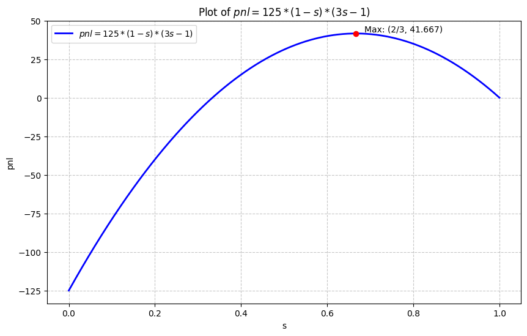

# Market Making
**Difficulty:** ⭐⭐⭐⭐  
**Topics:** Market Microstructure, Game Theory

*Tags: Market Microstructure, Adverse Selection, Glosten-Milgrom, Expected Value, Trading Theory*

---

## Problem Statement

You are tasked to make a market for 1000 traders, based on the outcome of a uniformly distributed number between 0 and 1.

* 500 of the traders are informed, meaning they know the outcome.
* 500 of the traders are uninformed, meaning they guess a random number between 0 and 1.

All 1000 traders can trade on your market, but they don't have to. They are reasonable, so they'll only trade if a profit is expected (assume uninformed traders draw a private valuation beforehand uniformly on [0, 1]).

How will your market look like?

---

## Solution Outline

Let the true outcome be $X \sim U[0,1]$

Making market would mean, for a contract that pays *X*, you have to make a **two-sided market** by quoting a bid *b* and an ask *a*, and hence a spread *s*.

There are:

* 500 informed traders, who know the exact value *X*
* 500 uninformed traders, who only know that $X \sim U[0,1]$
* You, the market maker, with $E[X] = 0.5$, as your prior since you have no information

All traders only trade when **expected profit $\geq 0$**.

### Monopolist Market Maker

Upon reading the problem, first thought comes to our mind is that the market maker is looking to maximize his profit which is the case of the monopolist. You quote spread *s* around your prior, hence, your bid/ask is

$$ b = \frac{1}{2} - \frac{s}{2} = \frac{(1 - s)}{2} $$

$$ a = \frac{1}{2} + \frac{s}{2} = \frac{(1 - s)}{2} $$

**Uninformed Traders**

The private numbers (estimate of true value) chosen by the uninformed traders, as given in the question, will be uniformly distributed between 0 and 1. Hence, they will only trade if their chosen number is less than your bid price *b* or greater than your ask price *a*.

If what they expect to be the true value is between your spread *s*, then they will believe they are losing out on the difference between bid/ask and true value.

Hence, only the traders outside the spread range *s* will trade i.e. $(1 - s)$ proportion of the total uninformed population. By symmetry half of them will be expected to buy and the other half sell. For each trade, you, the market maker will earn half the spread *s*. So your profit is,

$$ P = (1 - s) \cdot 500 \cdot \frac{s}{2} $$

**Informed Traders**

The informed traders know the actual value *X*, and will trade only when *X* is outside your spread range *s*, which means there is $(1 - s)$ probability they trade. Each trader is reasonable and aware, they will always trade to make profit, which means you will always lose out with informed traders.

Since you don't know the true value, your expectation of the true value seeing informed trades on buy(sell) side is the **midpoint** between ask(bid) and upper(lower) price bound (uniform distribution). This is because informed traders trade only when your ask(bid) is lower(higher) than actual price.

Traders will all either buy or sell which means your expected loss per trade is,

$$ \frac{(1 - s)}{4} $$

To see where this comes from, consider the buy side. Informed traders only buy when your ask is below actual price. Since your ask is at $(1 + s)/2$, conditioned on a buy, true value is uniformly between ask *a* and 1. The midpoint of that range is your estimate of the true value. So expected loss per trade is your estimate minus what you're charging:

$$ \frac{(1 + a)}{2} - a = \frac{(1 - a)}{2} = \frac{(1 - s)}{4} $$

Same logic applies to the sell side. Total expected loss will then be given by:

$$ L = (1 - s) \cdot 500 \cdot \frac{(1 - s)}{4} $$

**Market Maker's PNL**

From above, your expected PNL is:

$$ \mathbb{E}[PNL] = P - L $$

Substituting *P* and *L* from above,

$$ \mathbb{E}[PNL] = \frac{500 \cdot (1 - s)}{2} ( s - \frac{(1 - s)}{2} ) $$

$$ \mathbb{E}[PNL] = \frac{500 \cdot (1 - s)}{4} ( 2s - (1 - s) ) $$

$$ \mathbb{E}[PNL] = 125 \cdot (1 - s) ( 3s - 1 ) $$

If we plot this as a function of *s*, we can see that the maximum expected PNL occurs at $s = 2/3$, and its value is $\approx 41.67$. Obviously, you could also solve this by taking derivative of the above equation and setting it zero.

This implies that maximum profit is expected by setting the spread equal to *2/3*. Since our expectation of actual value *X* is **0.5** (we have no information), the market is as follows,

$$ \text{bid b} = \frac{1}{2} - \frac{1}{3} = \frac{1}{6} $$

$$ \text{ask a} = \frac{1}{2} + \frac{1}{3} = \frac{5}{6} $$

$$ \text{spread s} = \frac{2}{3} $$

### Competitive Markets (Glosten-Milgrom)

But what if markets are competitive, then you cannot maximize profit as other market makers can undercut you. This is how the real world works.

If you're earning good profits, someone else will come in and offer better spreads to capture your volume. This way everyone keeps competing, and eventually no one earns anything. This is the kind of world Glosten and Milgrom described in 1985.

Now there is a long way to solve this using conditional expectations but we won't get into it. Instead, we note that equilibrium, in this case, is unique where no one expects to make any profit (if they did, someone could come in and offer better prices), only to break even. 

We can thus use the result from the previous section. The symmetry assumptions hold in both cases, so the PNL expression remains same; we can just change the objective from maximizing it to zeroing it. Hence,

$$ \mathbb{E}[PNL] = 125 \cdot (1 - s) ( 3s - 1 )  = 0 $$

which gives $s = 1, 1/3$. Since spread = 1 doesn't make sense, $s = 1/3$ centered around the prior mean of 0.5. The market is as follows,

$$ \text{bid b} = \frac{1}{2} - \frac{1}{6} = \frac{1}{3} $$

$$ \text{ask a} = \frac{1}{2} + \frac{1}{6} = \frac{2}{3} $$

$$ \text{spread s} = \frac{1}{3} $$

What's interesting here is that this spread exists entirely because of informed traders (can be also seen from the profit equation, setting to zero implies $s = 0$). If there were no informed traders at all, competition would drive spread to zero and you'd just be a rounding service. The spread is the market's way of pricing the risk that whoever is on the other side of your trade might know something you don't.

---

## Key Insight

The competitive spread (*1/3*) is actually *tighter* than the monopolist spread (*2/3*). This might seem backwards as the monopolist is greedier, so surely they'd want to trade more? But the monopolist is optimizing for profit. They're willing to sacrifice volume to extract more margin per trade. The competitive maker has no such luxury, they're forced to the tightest defensible price, and that price is pinned entirely by the adverse selection problem, not by profit ambitions.