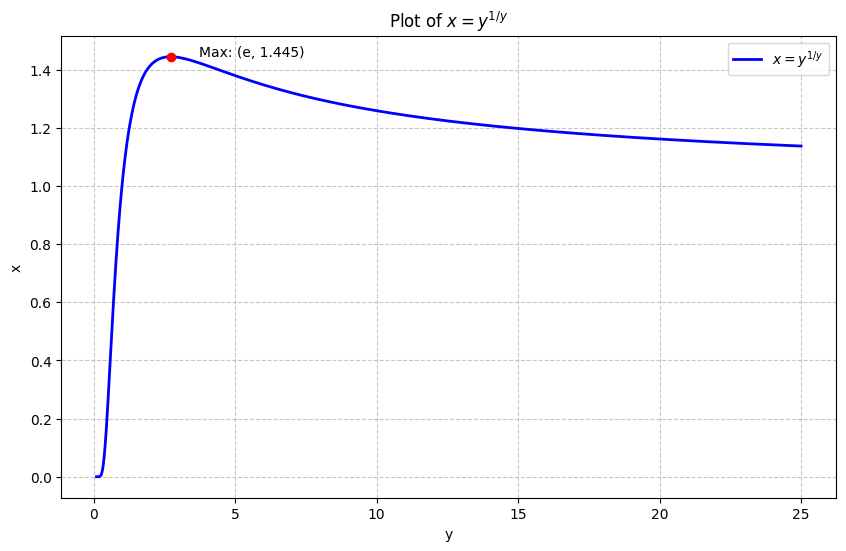

# Exponent upon Exponent
**Difficulty:** ⭐⭐⭐  
**Topics:** Analysis, Functional Equations

*Tags: Infinite Power Towers, Fixed Points, Lambert W Function, Monotone Convergence*

---

## Problem Statement

Most of us have seen and solved this question: If

$$ x^{x^{x^{.^{.^{.}}}}} = 2, $$

what is *x*? The inteneded solution entails onserving that the exponent of the bottom *"x"* is the same as the whole expression, thus $x^2 = 2, x = \sqrt{2}$. However, someone noticed that if the problem had instead specified that

$$ x^{x^{x^{.^{.^{.}}}}} = 4, $$

one would have obtained the same answer: $x = \sqrt[4]{4} = \sqrt{2}$.

Hmm. Just what is $\sqrt{2}^{\sqrt{2}^{\sqrt{2}^{.^{.^{.}}}}}$, anyway? Can you prove it?

---

## Solution Outline

Oh well, this is fascinating, isn't it? Most of us have seen and solved this question so many times that we now remember the answer in the back of our minds. But this is very unexpected and you can go and solve it again but the statement posed in the question is indeed correct. So what's the trick?

### Limit of Sequence

Define the sequence $\sqrt{2}$, $\sqrt{2}^{\sqrt{2}}$, $\sqrt{2}^{\sqrt{2}^{\sqrt{2}}}$, $\cdots$. Our expression is the limit of this sequence. The limit of this sequence exists; it is increasing and bounded above.

To prove monotonicity of the sequence, we can make use of induction. Let the sequence be $s_1, s_2, \cdots$; we prove that $1 < s_i < s_{i+1}$ for each $i \geq 1$. This is easy because $1 < \sqrt{2}$; the base case holds. Assume it holds for some $k$,

$$ s_{k+1} > s_k $$

We must now prove this holds for $k + 1$,

$$ s_{k+2} > s_{k+1} $$

Since $s_{k+2} = \sqrt{2}^{s_{k+1}}$ and $s_{k+1} = \sqrt{2}^{s_{k}}$ and we know for base > 1, exponent function is a **strictly increasing** function. And since $s_{k+1} > s_k$, $ s_{k+2} > s_{k+1} $ holds.

To get the bound of the sequence, observe something interesting, replace the top $\sqrt{2}$ in any of the $s_i$'s with a 2, and the whole expression collapses to 2 like a domino, which means this is bounded by 2.

We can also see the monotonicity and convergence if we calculate few values numerically:

```
$s_1 = 1.414$
$s_2 = 1.632$
$s_3 = 1.760$
$s_4 = 1.834$
$x_5 = 1.887$
```

### Solving the Limit

Since we have proved that the limit exists, lets call the limiting value *y*. This must satisfy the below equation,

$$ \sqrt{2}^y = y $$

Lets look at the plot for the equation

$$ x = y^{1/y} $$



We see from the plot that *x* is strictly increasing in *y* upto its maximum point at $y = e$ and strictly decreasing thereafter, which explains the two values of *y* corresponding to $x = \sqrt{2}$: $y = 2$ and $y = 4$.

Since we solved the bound for our equation to be 2, we can safely rule out 4 and conclude that $y = 2$.

Don't worry, what you were solving till now was indeed correct but the reason was a bit subtle.

### Range for Convergence

Generalizing the above using the plot, we can see that the expression $x^{x^{x^{.^{.^{.}}}}}$ is only meaningful and equal to the lower root of $x = y^{1/y}$, only when $1 \leq x \leq e^{1/e}$. It always converges to the lower root as an increasing sequence bounded above must converge to its least upper bound, which is also the statement of the **Monotone Convergence Theorem**, but do we really need it to see that? 

For $x = e^{1/e}$, both the roots converge and the expression is equal to *e*, but above $x = e^{1/e}$, the maximum point, the curve doesn't exist and the sequence diverges to infinity.

### General Solution (Lambert W Function)

Lets go back to the equation

$$ y = x^y $$

Rewrite,

$$ y = (e^{\ln x})^y = e^{y \ln x} $$

implies,

$$ ye^{-y \ln x} = 1 $$

Now the **Lambert W function**, $W(z)$, is defined as the inverse of $f(w) = we^w$. Essentially, if $z = we^w$, then $w = W(z)$. 

Now to use $W(z)e^{W(z)} = z$, the coefficient infront of the *e* must match the exponent. Lets multiply the above equation by $-\ln x$:

$$ (-y \ln x)e^{-y \ln x} = -\ln x $$

By definition,

$$ -y \ln x = W(- \ln x) $$

implies,

$$ y = \frac{W(- \ln x)}{-\ln x} $$

The Lambert W function has two branches:

* **Principle Branch ($W_0$)**: This gives the lower root, which is what we want in most of the cases.
* **Lower Branch ($W_{-1}$)**: The gives the upper root. This exists mathematically as discussed before, but the sequence can't reach it.

We can use look-up tables to get the value of Lambert W function for various *z* values or more easily you can use the *lambertw* function from the *scipy.special* library in Python to get the lower root.

---

## Key Insight

Infinite exponents may look like simple algebraic objects which we can manipulate directly, but in reality it should be interpreted as the limit of an iterative sequence. 
